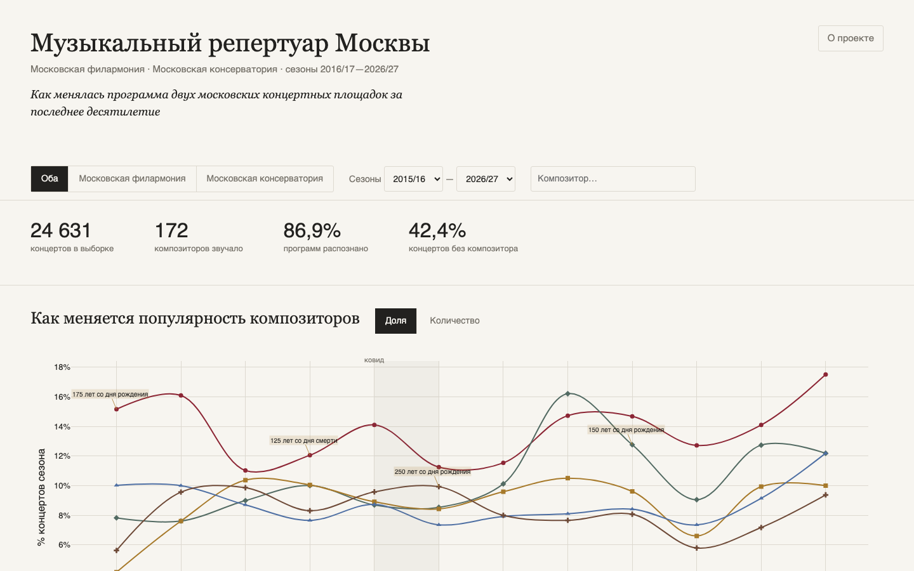

# concert-stats

Как менялся репертуар двух главных московских классических площадок за десятилетие:
**Московская филармония** (meloman.ru) и **Московская консерватория** (mosconsv.ru),
сезоны 2015/16–2026/27, 24 631 концерт.

**Открыть дашборд:** https://sserov.github.io/concert-stats/



## Что внутри дашборда

- **Как меняется популярность композиторов** — главный график: доля концертов сезона
  по каждому композитору, до 6 одновременно, с юбилейными отметками и полосой
  ковидного периода.
- **Кто звучит чаще всего** — таблица с сортировкой, спарклайнами и изменением доли
  к первому сезону.
- **Репертуар по сезонам** — тепловая карта топ-15 композиторов (кнопка «показать ещё»).
- **Один композитор — два зала** — сравнение долей филармонии и консерватории.
- **Карточка композитора** — клик по линии, ячейке или строке таблицы: тренд,
  разбивка по залам, юбилеи, последние концерты.
- **Насколько полны данные** — покрытие по сезонам с аннотациями провалов.

Основная метрика — **доля концертов (%), а не абсолютное количество**: охват
источников растёт от сезона к сезону, и абсолютные числа создают иллюзию роста
популярности. Пример: Шостакович стабильно занимает 3–4,5% программ, но в текущем
юбилейном сезоне 2026/27 — 10,3% (50 лет со дня смерти).

## Как это работает

```
mosconsv.ru  ──скрытый API /api/concert/forday──┐
                                                ├─ events.jsonl ── словарь ~180
meloman.ru   ──Wayback Machine CDX + live───────┘       композиторов
                                                              │
                                              dataset.json (дедуп, сезоны)
                                                              │
                                   агрегаты (доли, юбилеи, покрытие)
                                                              │
                                              docs/index.html (6,9 МБ,
                                              всё инлайн, Plotly с CDN)
```

- Композиторы извлекаются словарём с вариантами написания и эвристиками
  (омонимы: «Р. Штраус» ≠ «И. Штраус» ≠ просто «Штраус»).
- Сезон = сентябрь–июнь («2025/26»); июль–август относятся к предыдущему сезону.
- Один концерт = одна строка: доля — это доля концертов, где композитор звучал,
  а не число произведений.
- Программа распознана у 84% концертов с печатной программой; 42% концертов
  идут без программы вовсе (уведомления, лекции, концерты без печатной афиши).

## Быстрый старт

Требуется Python 3.13 и [uv](https://docs.astral.sh/uv/).

    uv sync
    uv run pytest -q                     # тесты (50, включая JS-селекторы через node)
    uv run python -m concert_stats.build_dataset
    uv run python -m concert_stats.build_dashboard
    open docs/index.html

### Полный сбор данных

    uv run python -m concert_stats.scrape_mosconsv --start 2016-01-01 --end 2026-09-26
    uv run python -m concert_stats.discover_meloman --from 2016 --to 2026
    uv run python -m concert_stats.scrape_meloman
    uv run python -m concert_stats.build_dataset
    uv run python -m concert_stats.build_dashboard

Скрапинг вежливый (пауза 0,3 с) и возобновляемый: сырые ответы кэшируются в
`data/raw/`, повторный запуск докачивает только недостающее. Инкрементальное
обновление — те же команды с новой датой `--end`.

## Покрытие данных и ограничения

Абсолютные количества концертов **зависят от охвата источников**, а не только от
реального числа событий:

| Период | Проблема |
|---|---|
| meloman до 2018/19 | частично восстановлен через Wayback Machine (провалы, например 52 концерта в 2017/18) |
| 2015/16 | усечён срезом данных (собрано с января 2016) |
| meloman 2025/26 | частичный захват (~719 концертов против ~1300 в норме) |
| 2019/20–2020/21 | ковидные ограничения |
| 2026/27 | текущий сезон, помечен «(тек.)» — данные неполные |

## Структура проекта

    src/concert_stats/
      composers.py        словарь композиторов и сопоставление
      fetcher.py          HTTP с кэшем, ретраями и фиксом TLS meloman
      scrape_mosconsv.py  сбор консерватории (API по дням)
      discover_meloman.py поиск URL meloman в Wayback CDX
      scrape_meloman.py   сбор филармонии (live → wayback fallback)
      build_dataset.py    дедуп, сезоны, dataset.json
      aggregates.py       предагрегаты для дашборда (доли, юбилеи, покрытие)
      build_dashboard.py  рендер docs/index.html из шаблона
      dashboard_app.js    логика дашборда (селекторы + рендеры, тесты в node)
    tests/                pytest + tests/js (node:test)
    data/                 события, датасет, кэш (в git — только dataset.json)
    docs/                 спецификации, аудит редизайна, скриншоты

Дизайн-документы: [аудит редизайна](docs/superpowers/dashboard-redesign-audit.md),
[спецификация](docs/superpowers/specs/2026-09-27-dashboard-redesign-design.md).

## Публикация

`docs/` деплоится на GitHub Pages через GitHub Actions
(`.github/workflows/pages.yml`): коммит в `main`, задевающий `docs/**`, выкатывает
обновление автоматически.
